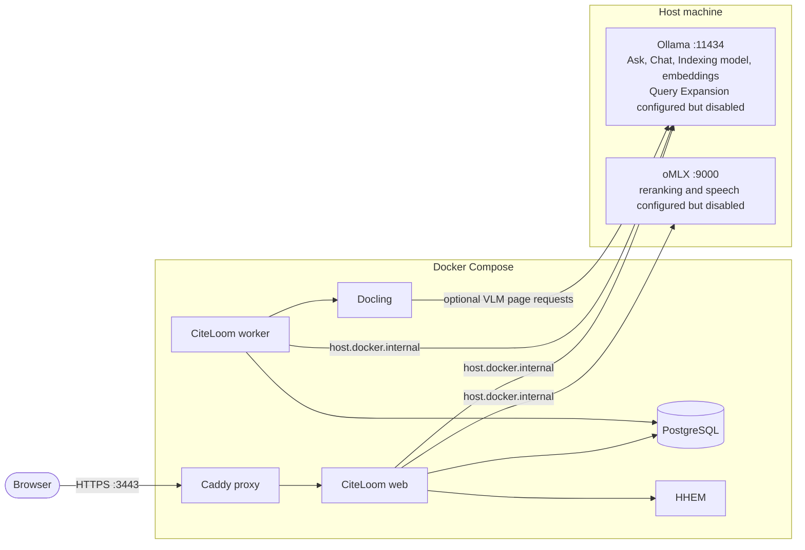
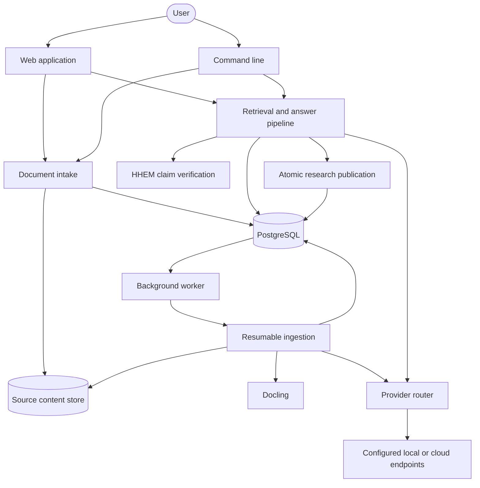

# CiteLoom

> Private documents, woven into cited answers.


[](LICENSE)


CiteLoom is a domain-agnostic Retrieval-Augmented Generation (RAG) system for your documents.
It supports PDF, HTML, DOCX, XLSX, PPTX, JPEG, PNG, WebP, and readable UTF-8 text files.

Use local or remote LLM providers while keeping generated answers connected to original evidence through validated citations.
CiteLoom also records advisory Hughes Hallucination Evaluation Model (HHEM) support scores for cited claims without allowing those scores to alter the answer.

See [Features](#features) for supported capabilities and [How it works](#how-it-works) for the ingestion, retrieval, citation, and claim-support flow.

## Features

- Ingest PDF, HTML, DOCX, XLSX, PPTX, JPEG, PNG, WebP, and readable UTF-8 text files.
- Organize a searchable document library with tags, catalog filters, ingestion controls, version history, evidence comparisons, reindexing, and guarded deletion.
- Choose Standard Docling processing or opt-in VLM processing that visually reads each PDF page through a configured provider and model.
- Resume interrupted indexing jobs from durable checkpoints, including completed page ranges for Standard PDFs.
- Search original evidence with meaning-based and keyword retrieval.
- Use generated text and table summaries to improve discovery without citing those summaries as source evidence.
- Ask questions across all ready documents, selected files, or tags, and rate retrieval, answer, and citation quality.
- Find exact-word or semantic source matches without generating an answer.
- Hold private document-grounded chats that retrieve relevant earlier turns while keeping every original message and citation snapshot.
- Inspect text, table, image, and highlighted PDF evidence for validated citations.
- Save and export research threads that keep their original answers, citations, and run settings.
- Dictate Ask questions and listen to Ask or Chat answers through independently configured speech providers, with optional asynchronous audio preloading.
- Route answers, Chat, Query Expansion, indexing, embeddings, reranking, transcription, and speech synthesis to different provider connections and models.
- Manage workspace accounts and roles, run service diagnostics, inspect sanitized operational errors, and purge retained error reports with confirmation.
- Reproduce retrieval runs with saved settings, stable seeds calculated from each request, consistent tie-breaking, and retrieval traces.
- Keep unmodified source files in a local content store while PostgreSQL stores metadata and durable references.

See the [complete feature guide](docs/features.md) for user workflows, administrator controls, availability, and recovery behavior.

## Requirements

- Docker with Docker Compose.
- Bash and curl for the local installer.
- Node.js 26.5.0 for source-based development outside Docker.
- Configured model providers for answers, Chat, the Indexing model, embeddings, and any enabled reranking or speech features.
- Enough local memory and storage for the selected models, PostgreSQL data, document artifacts, and extracted images.

The included Compose services provide PostgreSQL, Docling document conversion, and HHEM claim-support checks.
Model providers run separately.
CiteLoom starts independently of model providers, and users can configure any supported provider in Settings.

## Quick start

Clone the repository and create your local environment file.

```bash
git clone https://github.com/sageil/citeloom.git
cd citeloom
cp .env.example .env
chmod 600 .env
```

Set the initial administrator credentials and release tag in `.env`.

```dotenv
CITELOOM_ADMIN_USERNAME=Mayhem
CITELOOM_ADMIN_PASSWORD='replace-with-a-private-passphrase'
CITELOOM_IMAGE_TAG=0.2.1
CITELOOM_RELEASE=0.2.1
```

Pull the published images and start CiteLoom.

```bash
docker compose --env-file .env -f compose.dockerhub.yml pull
docker compose --env-file .env -f compose.dockerhub.yml up -d --wait
```

Open `https://localhost:3443` and sign in with the administrator account.
If the browser warns about the local development certificate, use its trust or continue flow for this local site.

A fresh database routes answers, Chat, the Indexing model, Query Expansion, and embeddings to Ollama.
Open Settings to use different providers or to enable reranking, speech-to-text, or text-to-speech.
See [Deployment](docs/deployment.md) for storage paths, restart behavior, and building the images locally.

### Build locally

Run the installer from the repository root to build the images locally.

```bash
./infra/scripts/install-local.sh
```

The installer creates `.env` when needed, asks for the initial administrator credentials, builds the stack, applies migrations, and waits for CiteLoom to become ready.

## Supported providers

Provider routing is configured per capability in Settings.
A provider can serve one capability while another provider serves the rest.

| Provider | Answers | Chat | Query Expansion | Indexing model | Embeddings | Reranking | Speech-to-text | Text-to-speech |
| --- | --- | --- | --- | --- | --- | --- | --- | --- |
| oMLX | Yes | Yes | Yes | Yes | Yes | Yes | Yes | Yes |
| Ollama | Yes | Yes | Yes | Yes | Yes | - | - | - |
| LM Studio | Yes | Yes | Yes | Yes | Yes | - | - | - |
| OpenAI | Yes | Yes | Yes | Yes | Yes | - | Yes | Yes |
| OpenAI Codex | Yes | Yes | Yes | Yes | - | - | - | - |
| DeepSeek | Yes | Yes | Yes | Yes | - | - | - | - |
| Groq | Yes | Yes | Yes | Yes | - | - | Yes | Yes |
| Cohere | Yes | Yes | Yes | Yes | Yes | Yes | - | - |
| Jina | - | - | - | - | Yes | Yes | - | - |
| Custom | Yes | Yes | Yes | Yes | Yes | Yes | Yes | Yes |

The table shows the provider adapters available for each capability.
Choose a model and endpoint that implement the selected capability.
OpenAI Codex uses device sign-in, while other profiles accept provider API tokens when their endpoints require authentication.
See [Configuration](docs/configuration.md#provider-reference) for endpoint conventions, feature routing, default models, and Thinking mode.

## Development Configuration

CiteLoom services run in Docker Compose, Ollama runs on the host at `http://host.docker.internal:11434`, and the optional oMLX server runs at `http://host.docker.internal:9000/v1`. Linux users, use the custom profile to configure Text-to-speech and Speech-to-text provider.
The tables below describe the configuration created for a fresh database.
Enabled means the feature is routed and active by default, while Disabled means a model profile may be saved but the feature is not active.
Availability does not confirm that a model has been downloaded or that its endpoint is running.

### Models

| Provider | Model | Features | Default Availability |
| --- | --- | --- | --- |
| Ollama | `qwen3.5:9b-mlx` | Ask and Chat | **Enabled** |
| Ollama | `qwen3.5:9b-mlx` | Query Expansion | **Disabled** - because expansion count is `0` in the default setting |
| Ollama | `qwen3.5:9b` | Indexing model | **Enabled** |
| Ollama | `snowflake-arctic-embed:137m` | Embeddings | **Enabled** |
| Ollama | `frob/unlimited-ocr:q8_0` | Docling VLM PDF processing | **Disabled** |
| HHEM | `HHEM-2.1-Open` | Claim support scoring | **Enabled** |
| oMLX | `gte-reranker-modernbert-base` | Reranking | **Disabled** |
| oMLX | `Qwen3-ASR-1.7B-8bit` | Speech-to-text | **Disabled** |
| oMLX | `Kokoro-82M-bf16` with voice `af_heart` | Text-to-speech | **Disabled** |


### Features

| Feature | Availability | Development default |
| --- | --- | --- |
| Ask | **Enabled** | Routed to Ollama |
| Chat | **Enabled** | Uses the Ollama answer model |
| Indexing model | **Enabled** | Routed to Ollama |
| Embeddings | **Enabled** | Routed to Ollama with 768 output dimensions |
| Claim support scoring | **Enabled** | Uses HHEM at `http://host.docker.internal:8088` with a `0.7` support threshold |
| Query Expansion | **Disabled** | The configured expansion count is `0` |
| Reranking | **Disabled** | No provider is routed |
| Speech-to-text | **Disabled** | No provider is routed |
| Text-to-speech | **Disabled** | No provider is routed and model preloading is off |
| Standard Docling processing | **Enabled** | Uses the `standard` pipeline |
| Docling OCR | **Enabled** | OCR processing is on |
| Docling table extraction | **Enabled** | Table structure extraction uses `accurate` mode |
| Docling table-of-contents extraction | **Enabled** | TOC extraction is on |
| Docling VLM PDF processing | **Disabled** | The VLM profile is saved but the VLM pipeline is not selected |
| AI request metrics | **Enabled** | AI request diagnostics are recorded |
| Docling performance metrics | **Disabled** | Conversion performance diagnostics are not recorded |
| Ollama adaptive context sizing | **Enabled** | Applies to native Ollama GGUF language models |
| Thinking mode | **Disabled** | Disabled for every saved provider profile |

The default Ollama profile allows one parallel request.
The `-mlx` models are intended for Macs.
Linux users should select compatible non-MLX models available in their Ollama installation.
Embeddings, MLX runners, and other providers remain outside Ollama adaptive context allocation.
See [Configuration](docs/configuration.md) for all runtime settings and [Ollama automatic context size](docs/configuration.md#ollama-automatic-context-size) for sizing examples, operational requirements, fallback behavior, and opt-out instructions.



## How it works

CiteLoom uses one application core across the web interface, command-line interface, and background worker.



### Ingestion

Structure-aware processing discovers the organization of each document, extracts its content, and divides it into searchable sections.
CiteLoom creates summaries and embeddings before publishing the completed index.
Completed checkpoints let interrupted jobs resume from their last finished step.
The current document remains searchable while a replacement index is being built.

### Retrieval

For each question, CiteLoom first decides which documents are in scope.

It then uses several retrieval methods:

- Semantic search uses pgvector cosine similarity to find related content.
- BM25 keyword search finds exact terms and phrases.
- Weighted Reciprocal Rank Fusion combines semantic and keyword results.
- Optional Query Expansion can search for additional interpretations of the question.
- Optional relevance-model reranking can move stronger evidence into the answer context.

After ranking the results, CiteLoom loads the original evidence used to generate the cited answer.

### Citations and claim support

CiteLoom keeps generated answers connected to their sources:

- Generated descriptions can improve discovery, but citations always point to original evidence.
- Evidence references are validated before they become citations.
- The Hughes Hallucination Evaluation Model (HHEM) records an advisory support score for each cited claim.
- HHEM scores help reviewers identify potentially unsupported claims, but never remove, rewrite, or add answer content.

See [Architecture](docs/architecture.md) for the detailed execution paths and system boundaries.

## Command-line usage

Run `pnpm dev --help` for the application command-line reference.
See [pnpm commands](docs/commands.md) for every package script and its purpose.

| Command | Purpose |
| --- | --- |
| `pnpm run doctor:docker` | Check configured Docker services, PostgreSQL, migrations, and retrieval extensions |
| `pnpm run doctor:source` | Check services configured for a host-run source environment |
| `pnpm ingest [options] <path>` | Ingest files or directories immediately or enqueue them |
| `pnpm worker [--once]` | Process queued ingestion phases |
| `pnpm status` | Show queue, worker, retry, and model-request capacity |
| `pnpm documents list` | List documents, jobs, and embedding spaces |
| `pnpm ask [scope] -- <question>` | Ask from an explicit document scope |

Ingest a directory in the background and assign a tag.

```bash
pnpm ingest --enqueue --recursive --tag research ./documents/research
```

Ask across ready documents carrying that tag.

```bash
pnpm ask --tag research -- "What findings are supported across these documents?"
```

## Documentation

- [Agent onboarding](LLM.MD) gives coding agents a guided repository tour, setup path, architectural boundaries, and verification workflow.
- [Features](docs/features.md) describes the complete member and administrator feature set.
- [Architecture](docs/architecture.md) explains ingestion, retrieval, answer publication, and service ownership.
- [Configuration](docs/configuration.md) explains environment loading, providers, retrieval settings, and processing capacity.
- [pnpm commands](docs/commands.md) explains every package script and when to use it.
- [Deployment](docs/deployment.md) covers local production builds, Compose, HTTPS, and administrator setup.
- [Operations](docs/operations.md) covers migrations, backups, restore, reindexing, and embedding-space retention.
- [Evaluation](docs/evaluation.md) covers datasets, offline scoring, tuning, frozen configurations, and audited claim verification.
- [Evaluation corpora](corpora/README.md) covers source downloads, licensing, source history, and corpus selection.
- [Server source layout](src/README.md) documents directory ownership and dependency rules.
- [Contributing](CONTRIBUTING.md) covers development workflow, verification, and pull requests.
- [Security](SECURITY.md) explains private vulnerability reporting and supported security scope.
- [Code of Conduct](CODE_OF_CONDUCT.md) defines community expectations and enforcement.

## Development

Follow [Contributing](CONTRIBUTING.md) for the complete source setup, development workflow, and pull request requirements.

Run the Biome linter without applying fixes.

```bash
pnpm lint
```

Apply Biome's safe lint fixes after code changes.

```bash
pnpm lint:fix
```

Run the basic test suite.

```bash
pnpm test
```

Run the same GitHub-compatible unit and contract suite with production-source coverage thresholds.

```bash
pnpm test:coverage
```

Run every unit suite, including evaluation, corpus, and CLI workflow coverage.

```bash
pnpm test:all
```

Run validation, type checks, the complete isolated unit suite, and the production build before release.

```bash
pnpm check
```

Database integration tests use an isolated service.

```bash
pnpm services:test:up
pnpm test:integration
pnpm services:test:stop
```

Pull requests should report the verification commands that were run and keep unrelated cleanup separate.

## Planned Features

- Shared source storage with SeaweedFS is planned for multi-host deployments.
- Multi providers creation & configuration
- Additional Providers
- French language support.

## License

CiteLoom is licensed under the [GNU Affero General Public License v3](LICENSE).
