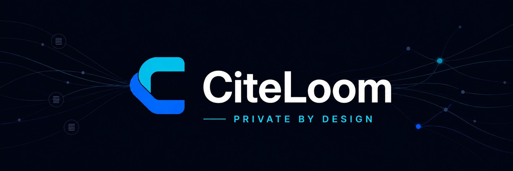

# CiteLoom

> Private documents, woven into cited answers.

▶ [Watch the CiteLoom demo on YouTube](https://youtu.be/DsbCPF8GD4I)

CiteLoom is a Retrieval-Augmented Generation (RAG) system that lets you ask questions and chat with your documents.
Its findings link back to the original evidence.
It can use local or remote model providers, and it keeps saved answers tied to the exact document versions used at the time.

## What you can do

- Build a searchable library from documents, spreadsheets, presentations, images, and readable text files.
- Ask questions across all ready documents, selected files, or tagged collections.
- Find exact or related source material without generating an answer.
- Continue private, document-grounded chats with retained citation evidence.
- Inspect cited text, tables, images, and highlighted source passages.
- Save, rate, export, and revisit research without rerunning the models.
- Route language, embedding, ranking, document-processing, and speech work to different providers.
- Operate the workspace with accounts, roles, diagnostics, durable jobs, backups, and recovery tools.

The [feature guide](docs/features.md) lists the supported formats, user features, administrator controls, and important limits.

## Install CiteLoom

The supplied Docker Compose deployment includes the web application, worker, PostgreSQL, Docling document conversion, HHEM citation-support checks, and local HTTPS through Caddy.
Model providers run separately and are selected in Settings after installation.

Follow [Deployment](docs/deployment.md) to install published images or build the stack from source.
The guide includes prerequisites, persistent storage, administrator bootstrap, HTTPS, and a verification checklist.

## Understand the answer

CiteLoom searches only the ready documents in the selected scope.
It may use generated descriptions to improve discovery, but published citations always point to original document evidence.
The server validates every citation before publication.

HHEM support scores are advisory review signals, not guarantees of correctness.
They never add, remove, or rewrite answer content or citations.
Always inspect the linked evidence before relying on an important answer.

## Documentation

Choose the guide that matches the work you need to do.

| Goal | Guide |
| --- | --- |
| Learn the available workflows and product limits | [Features](docs/features.md) |
| Install or deploy CiteLoom | [Deployment](docs/deployment.md) |
| Configure providers, search, speech, and document processing | [Configuration](docs/configuration.md) |
| Back up, restore, reindex, diagnose, or recover the service | [Operations](docs/operations.md) |
| Look up a package command | [pnpm commands](docs/commands.md) |
| Understand system boundaries and execution paths | [Architecture](docs/architecture.md) |
| Work with evaluation datasets and tuning | [Evaluation](docs/evaluation.md) |
| Download or update the evaluation corpus | [Evaluation corpora](corpora/README.md) |
| Set up a development environment or contribute | [Contributing](CONTRIBUTING.md) |
| Find the owning server directory | [Server source layout](src/README.md) |
| Onboard a coding agent | [Agent onboarding](LLM.MD) |
| Report a vulnerability | [Security](SECURITY.md) |

The application also includes task-focused Help for workspace members.

## License

CiteLoom is licensed under the [GNU Affero General Public License v3](LICENSE).
