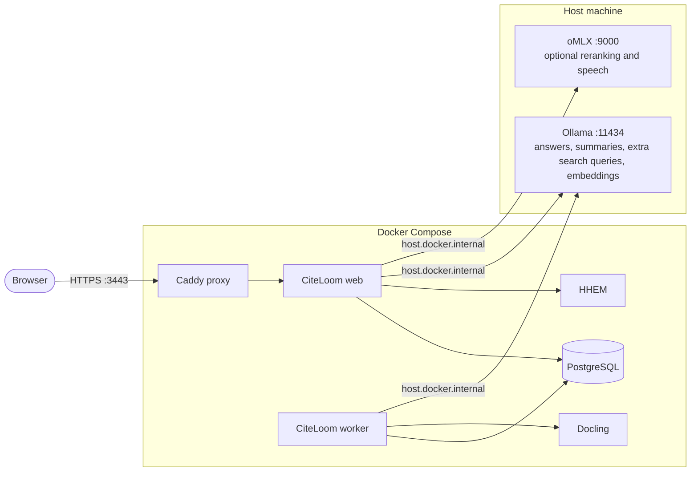

# CiteLoom

> Private documents, woven into cited answers.


[](LICENSE)


CiteLoom is an open-source, self-hosted Retrieval-Augmented Generation (RAG) system for private documents.
It combines structure-aware document processing, embedding search with pgvector cosine similarity, BM25 keyword search, optional extra search queries, weighted Reciprocal Rank Fusion, and optional relevance-model reranking to find evidence across text, tables, and images.
Generated descriptions can improve discovery, but citations always point back to original evidence.
It generates structured answers using exact evidence references, converts them into server-owned citations, and stores advisory Hallucination Evaluation Model (HHEM) support checks alongside each cited claim without allowing those scores to change the answer.

## Features

- Ingest PDF, HTML, DOCX, XLSX, PPTX, JPEG, PNG, WebP, and readable UTF-8 text files.
- Resume interrupted indexing jobs from durable checkpoints.
- Search original evidence with meaning-based and keyword retrieval.
- Use generated text and table summaries to improve discovery without citing those summaries as source evidence.
- Ask questions across all ready documents, selected files, or tags.
- Hold private document-grounded chats that retrieve relevant earlier turns while keeping every original message and citation snapshot.
- Inspect text, table, image, and highlighted PDF evidence for validated citations.
- Save and export research threads that keep their original answers, citations, and run settings.
- Reproduce retrieval runs with saved settings, stable seeds calculated from each request, consistent tie-breaking, and retrieval traces.
- Keep unmodified source files in a local content store while PostgreSQL stores metadata and durable references.

## Requirements

- Docker with Docker Compose.
- Bash and curl for the local installer.
- Node.js 26.5.0 for source-based development outside Docker.
- Configured model providers for answers, chat, summarization, embeddings, and any enabled reranking or speech features.
- Enough local memory and storage for the selected models, PostgreSQL data, document artifacts, and extracted images.

The included Compose services provide PostgreSQL, Docling document conversion, and HHEM claim-support checks.
Model providers run separately.
CiteLoom starts independently of model providers, and users can configure any supported provider in Settings.

## Quick start

Clone the repository and create your local environment file.

```bash
git clone https://github.com/sageil/citeloom.git
cd citeloom
cp .env.example .env
chmod 600 .env
```

Set the initial administrator credentials and release tag in `.env`.

```dotenv
CITELOOM_ADMIN_USERNAME=Mayhem
CITELOOM_ADMIN_PASSWORD='replace-with-a-private-passphrase'
CITELOOM_IMAGE_TAG=0.1.2
CITELOOM_RELEASE=0.1.2
```

Pull the published images and start CiteLoom.

```bash
docker compose --env-file .env -f compose.dockerhub.yml pull
docker compose --env-file .env -f compose.dockerhub.yml up -d --wait
```

Open `https://localhost:3443` and sign in with the administrator account.
If the browser warns about the local development certificate, use its trust or continue flow for this local site.

A fresh database routes answers, chat, summaries, extra search queries, and embeddings to Ollama.
Open Settings to use different providers or to enable reranking, speech-to-text, or text-to-speech.
See [Deployment](docs/deployment.md) for storage paths, restart behavior, and building the images locally.

### Build locally

Run the installer from the repository root to build the images locally.

```bash
./infra/scripts/install-local.sh
```

The installer creates `.env` when needed, asks for the initial administrator credentials, builds the stack, applies migrations, and waits for CiteLoom to become ready.

## Supported providers

Provider routing is configured per capability in Settings.
A provider can serve one capability while another provider serves the rest.

| Provider | Answers | Chat | Extra search queries | Summaries | Embeddings | Reranking | Speech-to-text | Text-to-speech |
| --- | --- | --- | --- | --- | --- | --- | --- | --- |
| oMLX | Yes | Yes | Yes | Yes | Yes | Yes | Yes | Yes |
| Ollama | Yes | Yes | Yes | Yes | Yes | - | - | - |
| LM Studio | Yes | Yes | Yes | Yes | Yes | - | - | - |
| OpenAI | Yes | Yes | Yes | Yes | Yes | - | Yes | Yes |
| OpenAI Codex | Yes | Yes | Yes | Yes | - | - | - | - |
| DeepSeek | Yes | Yes | Yes | Yes | - | - | - | - |
| Groq | Yes | Yes | Yes | Yes | - | - | Yes | Yes |
| Cohere | Yes | Yes | Yes | Yes | Yes | Yes | - | - |
| Jina | - | - | - | - | Yes | Yes | - | - |
| Custom | Yes | Yes | Yes | Yes | Yes | Yes | Yes | Yes |

The table shows the provider adapters available for each capability.
Choose a model and endpoint that implement the selected capability.
OpenAI Codex uses device sign-in, while other profiles accept provider API tokens when their endpoints require authentication.
See [Configuration](docs/configuration.md#provider-reference) for endpoint conventions, feature routing, default models, and Thinking mode.

## Fresh-install provider defaults

CiteLoom services run in Docker Compose while local model servers run on the host.
Fresh settings use Ollama for answers, chat, extra search queries, summaries, and embeddings, and include oMLX model suggestions for optional reranking and speech.
Adaptive inference is enabled by default for native Ollama GGUF language models.
It uses a 65,536-token floor capped by the model maximum, grows bounded answer requests when their calculated requirement is larger, and reuses larger resident runners without shrinking them.
Summaries, vision, tools, reasoning, and unbounded answers use the model maximum reported by Ollama.
Embeddings, MLX runners, and other providers remain outside adaptive allocation.
See [Ollama Adaptive inference](docs/configuration.md#ollama-adaptive-inference) for sizing examples, operational requirements, fallback behavior, and opt-out instructions.
Users can route speech-to-text and text-to-speech independently to oMLX, OpenAI, Groq, or Custom.
Users can optionally enable reranking with oMLX, Cohere, Jina, or Custom.

| Runtime | Model | Status and use |
| --- | --- | --- |
| Ollama | `gemma4:e4b-mlx` | Answer generation, chat, summarization, and extra search queries |
| Ollama | `snowflake-arctic-embed:137m` | Document and query embeddings |
| oMLX | `gte-reranker-modernbert-base` | Available for optional retrieval reranking when routed |
| oMLX | `Qwen3-ASR-1.7B-8bit` | Available for speech-to-text transcription when routed |
| oMLX | `Kokoro-82M-bf16` | Available for text-to-speech synthesis with the `af_heart` voice when routed |
| Docker Compose | `vectara/hallucination_evaluation_model` | Independent claim-support verification through HHEM |

The `gemma4:e4b-mlx` default is an MLX model for Macs.
Linux users should remove the `-mlx` suffix and configure `gemma4:e4b` instead, or Ollama will fail because the configured Mac model is unavailable.



## How it works

CiteLoom uses one application core across the web interface, command-line interface, and background worker.


During ingestion, CiteLoom discovers document structure, splits content into searchable sections, creates summaries and embeddings, and then publishes the completed index.
Completed checkpoints let interrupted jobs resume from their last finished step.
The current document remains searchable while a replacement index is being built.

For each question, CiteLoom first decides which documents are in scope.
It then combines meaning-based and keyword results, optionally reranks them, and loads the original evidence used to generate the cited answer.
Reranking can improve answer and citation accuracy by moving more relevant evidence into the answer context.
See [Architecture](docs/architecture.md) for the detailed execution paths and system boundaries.

## Command-line usage

Run `pnpm dev --help` for the application command-line reference.
See [pnpm commands](docs/commands.md) for every package script and its purpose.

| Command | Purpose |
| --- | --- |
| `pnpm run doctor:docker` | Check configured Docker services, PostgreSQL, migrations, and retrieval extensions |
| `pnpm run doctor:source` | Check services configured for a host-run source environment |
| `pnpm ingest [options] <path>` | Ingest files or directories immediately or enqueue them |
| `pnpm worker [--once]` | Process queued ingestion phases |
| `pnpm status` | Show queue, worker, retry, and model-request capacity |
| `pnpm documents list` | List documents, jobs, and embedding spaces |
| `pnpm ask [scope] -- <question>` | Ask from an explicit document scope |

Ingest a directory in the background and assign a tag.

```bash
pnpm ingest --enqueue --recursive --tag research ./documents/research
```

Ask across ready documents carrying that tag.

```bash
pnpm ask --tag research -- "What findings are supported across these documents?"
```

## Documentation

- [Agent onboarding](LLM.MD) gives coding agents a guided repository tour, setup path, architectural boundaries, and verification workflow.
- [Architecture](docs/architecture.md) explains ingestion, retrieval, answer publication, and service ownership.
- [Configuration](docs/configuration.md) explains environment loading, providers, retrieval settings, and processing capacity.
- [pnpm commands](docs/commands.md) explains every package script and when to use it.
- [Deployment](docs/deployment.md) covers local production builds, Compose, HTTPS, and administrator setup.
- [Operations](docs/operations.md) covers migrations, backups, restore, reindexing, and embedding-space retention.
- [Evaluation](docs/evaluation.md) covers datasets, offline scoring, tuning, frozen configurations, and audited claim verification.
- [Evaluation corpora](corpora/README.md) covers source downloads, licensing, source history, and corpus selection.
- [Server source layout](src/README.md) documents directory ownership and dependency rules.
- [Contributing](CONTRIBUTING.md) covers development workflow, verification, and pull requests.
- [Security](SECURITY.md) explains private vulnerability reporting and supported security scope.
- [Code of Conduct](CODE_OF_CONDUCT.md) defines community expectations and enforcement.

## Development

Follow [Contributing](CONTRIBUTING.md) for the complete source setup, development workflow, and pull request requirements.

Run Biome against maintained TypeScript and browser JavaScript.

```bash
pnpm lint
```

Apply Biome's safe lint fixes when reviewing the resulting source changes.

```bash
pnpm lint:fix
```

Run the production-focused unit suite during routine development.

```bash
pnpm test
```

Run every isolated unit suite, including evaluation, corpus, and CLI workflow coverage.

```bash
pnpm test:all
```

Run validation, type checks, the complete isolated unit suite, and the production build before release.

```bash
pnpm check
```

Database integration tests use an isolated service.

```bash
pnpm services:test:up
pnpm test:integration
pnpm services:test:stop
```

Pull requests should report the verification commands that were run and keep unrelated cleanup separate.

## Current scope

CiteLoom currently supports local deployments backed by one database.
The automated test suite does not download model weights or call live models.
Shared source storage with SeaweedFS is planned for multi-host deployments.

## License

CiteLoom is licensed under the [GNU Affero General Public License v3](LICENSE).
