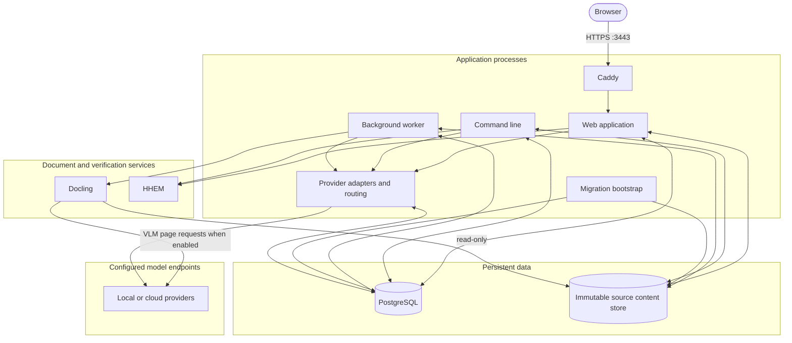
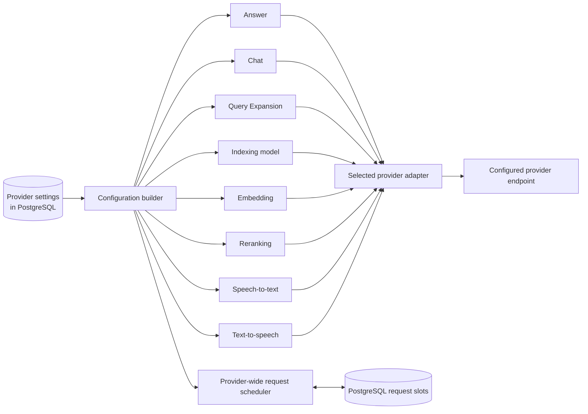
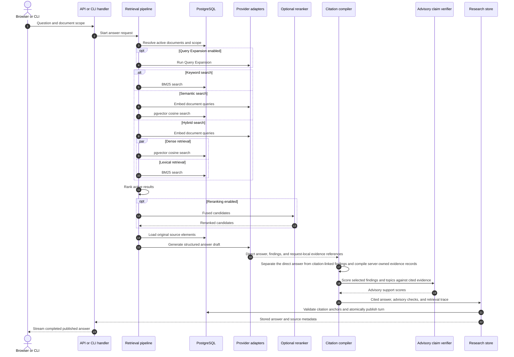

# Architecture

CiteLoom uses the same application core for its web interface, command-line interface, and background worker.
PostgreSQL stores document metadata, processing state, search indexes, settings, and shared limits for model requests.
A separate content store keeps each original source file unchanged and identifies it by its SHA-256 hash.
The web application, worker, and Docling service all use this store.
Migration saves its path in PostgreSQL, which becomes the shared location used by application processes.

## Components

| Component | Responsibility |
| --- | --- |
| Web application | Document ingestion, catalog browsing, source discovery, questions, settings, and diagnostics |
| Fastify server | Request validation, uploads, catalog operations, and streamed answers |
| Application core | Document conversion, indexing preparation, embeddings, search, reranking, and cited answer generation |
| Background worker | Resumable document processing with jobs shared through PostgreSQL |
| Local source content store | Immutable raw source bytes addressed by SHA-256 |
| PostgreSQL | Source records, processing results, jobs, settings, search indexes, and shared model-request limits |
| Docling | Standard or VLM document conversion that preserves reading order, tables, page locations, and image regions |
| Model providers | VLM page reading, indexing descriptions, embeddings, Query Expansion, reranking, answers, Chat, and optional speech |
| HHEM service | Support scores for individual answer claims and their cited evidence |
| Offline evaluation tools | Dataset generation, corpus management, scoring, tuning, and configuration freezes outside the production build |

See [the server source layout](../src/README.md) for directory ownership and dependency rules.
Evaluation tools live in [`tools/evaluation/`](../tools/evaluation/) and depend on the application core in one direction.
Production builds contain the application core without the evaluation tooling.

## Runtime topology

The provider router is application code inside each web, worker, or command-line process.
It is not a separate network service.
PostgreSQL coordinates provider-wide request limits across those processes.

The supplied Compose files run Caddy, web, worker, migration, PostgreSQL, Docling, and HHEM containers.
Local model servers such as LM Studio, Ollama, and oMLX normally run on the host and are reached from containers through `host.docker.internal`.
Cloud providers use the configured HTTPS endpoint.

## Provider routing

Provider connections, capability routes, model overrides, credentials, and concurrency limits are stored in PostgreSQL.
The application builds one typed runtime configuration and then applies the selected adapter for each capability.
Docling VLM processing is configured separately from the capability routes, but it reuses the selected provider connection's answer endpoint, credential, and model unless an administrator enters a VLM model override.

Routing is capability-specific, but concurrency is provider-specific.
If answer generation, Chat, the Indexing model, and embeddings all use one provider, they share that provider's configured request limit.
See [Provider reference](configuration.md#provider-reference) for the complete capability matrix and endpoint conventions.

## Document ingestion

An ingestion job discovers document structure, divides content into searchable sections, creates retrieval descriptions and embeddings, and publishes the finished index.
Section paths remain part of each passage's embedding text.
CiteLoom embeds the document filename once and blends that vector into each passage and media-description vector with a 0.1 filename weight and a 0.9 content weight.
Document titles and section outlines are not independent retrieval candidates and cannot consume the candidate budget.
The current document remains searchable until its replacement is complete.

The worker submits one Docling task to extract structure, text from images, tables, and cropped pictures.
It saves the task ID so another worker can resume the same task after an interruption.
Each Docling instance reads the source directly from the same read-only content store.
If the original Docling instance no longer recognizes a saved task, the worker clears that task checkpoint and submits the same unchanged source again.
Completed checkpoints remain available when the worker schedules a retry.

Standard is the default conversion pipeline.
For eligible Standard PDFs, the supplied Docling service converts bounded page ranges, saves each completed range, and assembles the final document only after all ranges succeed.
This lets a replacement Docling process continue from the next incomplete range.

VLM processing renders each PDF page as an in-memory PNG inside Docling and sends that page with the configured prompt to the selected provider's image-capable chat endpoint.
The page image is not persisted as a separate source file.
VLM conversion retains CiteLoom's remote task-ID recovery, but it does not use the Standard pipeline's page-range checkpoints or partial-document assembly.
If Docling no longer recognizes a VLM task, the unchanged source is submitted as a new task.

When document TOC routing is enabled, the indexing phase builds a bounded navigation map from Docling section paths and maps every retained entry to exact retrieval-window IDs.
The map is staged under the same generation as the vectors and lexical rows, validated before atomic publication, and removed with obsolete retrieval generations.

Source deletion is recorded in PostgreSQL before the local file is removed.
The worker retries pending deletions after a restart, and the same per-hash database lock serializes publication with deletion.
Newly stored content has a one-hour grace period.
This prevents cleanup from removing a file while its job is being created and limits how long files from a failed intake remain unused.

## Question answering

Before searching, CiteLoom resolves the exact set of documents selected for the question.
The application-wide Search method selects BM25 keyword retrieval, meaning-based vector retrieval, or both paths in parallel.
Keyword retrieval does not call the embedding model for the document query.
Semantic and Hybrid retrieval embed the original document query and every configured expansion.
When Query Expansion is enabled, CiteLoom also searches the generated query variations through the selected retrieval method.
At a configured count of 0, CiteLoom does not call the extra-search-query model.
It then ranks the active results and can optionally rerank the best candidates.
When a published TOC map is available and the selected method includes vector retrieval, CiteLoom may select relevant branches from the strongest normally retrieved document and merge their mapped passages into the candidate ranking before reranking.
TOC entries remain unavailable to answer generation and citation publication.
Reranking can improve answer and citation accuracy by using a specialized relevance model to reorder candidates before CiteLoom selects the answer context.

Each answer run uses the configured sampling temperatures.
In stable seed mode, CiteLoom derives separate seeds for Query Expansion and answer generation from the normalized original question and the sorted IDs of the selected documents.
In random mode, the model provider chooses the sampling randomness.

CiteLoom publishes the direct answer without citation markers and attaches validated citations only to supporting findings or topics.
HHEM claim-support scoring is a separate advisory check that measures whether cited evidence appears to support the selected atomic statements.
Ask selects supporting findings, while Chat selects ordered answer topics.
The direct synthesis is not sent to HHEM.
Exact duplicate claim and evidence pairs are scored once and their result is reused for each matching statement.
HHEM scores never remove, replace, or rewrite answer statements or citations, and they never convert a cited response into an uncited response.
When HHEM is unavailable or times out, CiteLoom publishes the cited answer with unverified advisory checks.
Structured answer validation and citation validation remain publication requirements.
Cancellations and service failures keep their own status.

## Document chat

Chat is separate from Ask and is available only to the conversation creator in the active workspace.
Chat owns its system prompt, user-prompt framing, and direct-answer response contract.
Each user message is stored before retrieval or generation begins.
Each completed assistant response stores its rendered answer, citation snapshots, retained image evidence, retrieval trace, memory trace, and run configuration.
User and assistant messages are embedded in the active embedding space for conversation-memory retrieval, but those embeddings are an index rather than evidence.

Short conversations use complete prior user and assistant turns in chronological order.
When the conversation exceeds its memory budget, CiteLoom combines the most recent complete turns with semantically relevant earlier complete turns.
Each selected prior assistant answer includes a citation source map built from its stored citation snapshots so its numeric citation markers retain their document identity.
Conversation memory can clarify a follow-up, but it cannot support a factual claim or replace currently retrieved document evidence.
If document retrieval finds no relevant evidence, Chat publishes an uncited response instead of using model knowledge.
An answered Chat response contains a substantive direct synthesis and may add ordered topics for distinct parts of a comprehensive response.
The Chat model contract represents the direct synthesis separately from those topics and does not include a findings field.
The model response carries exact request-local evidence references for the direct synthesis and each topic so the server can validate grounding before publication.
The published direct synthesis does not retain citation links, while each published topic retains its validated citations.
The model may cite only request-local evidence references, and the server resolves those references to stored source elements before publication.
Chat sends only its topics to HHEM because they are the atomic supporting statements presented for verification.
The direct synthesis is not an HHEM input.
Chat stores the resulting checks as diagnostic metadata and never uses them to reject, remove, or rewrite the answer.

Chat run leases are renewable and retry attempts are fenced by an attempt number.
This prevents an expired worker from publishing after a newer attempt has taken ownership.
Assistant publication is atomic, so a completed run cannot expose a response without its embeddings, citation evidence, traces, and configuration.

Deleting a library document does not alter any chat, even when that document was the only source used by a response.
The chat retains the cited evidence snapshot and an independent reference to the immutable source bytes.
When a response cites multiple documents, every citation remains readable regardless of which library documents are later removed.
The retained source bytes become eligible for cleanup only after no library, ingestion, index, document-version, or chat-evidence record references them.
Deleting the chat removes its messages, embeddings, and citation records, then queues any source bytes that have no remaining references for durable cleanup.

## Persistence and concurrency

PostgreSQL leases coordinate background workers and model-request capacity across processes.
Requests routed to the same provider share that provider's request limit across the deployment.
The database publishes a completed document index in one operation, keeping partial replacements out of search.

Saved research threads keep their original answers, citations, claims, and run settings.
Each new turn also stores its generated queries, ordered source results, and exact sampling settings in a retrieval trace.
Every new turn has a retrieval trace, while older turns remain readable without one.
Submitting a question creates a new run.
Opening a saved turn returns the stored result without searching or generating it again.
The server remains the source of truth for citation identity and source metadata.
Saved chats keep their original messages and retained citation evidence independently of the current library.
