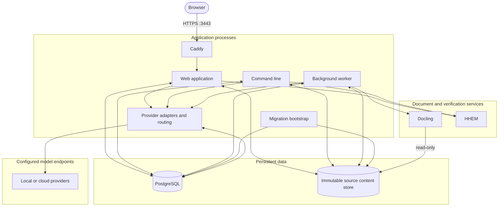
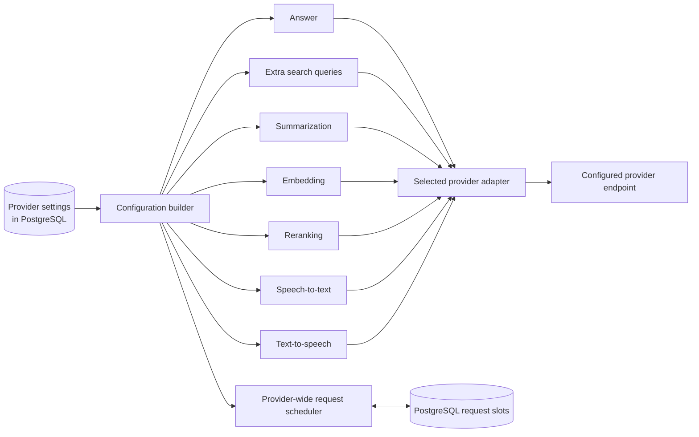
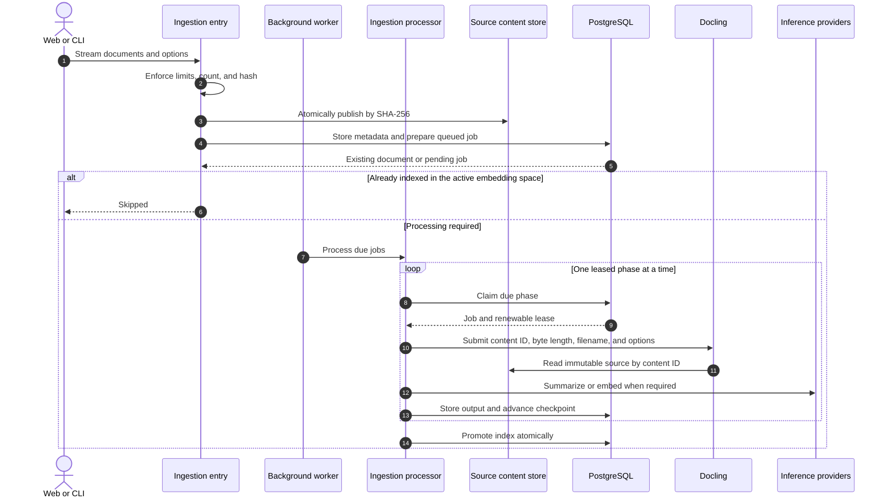
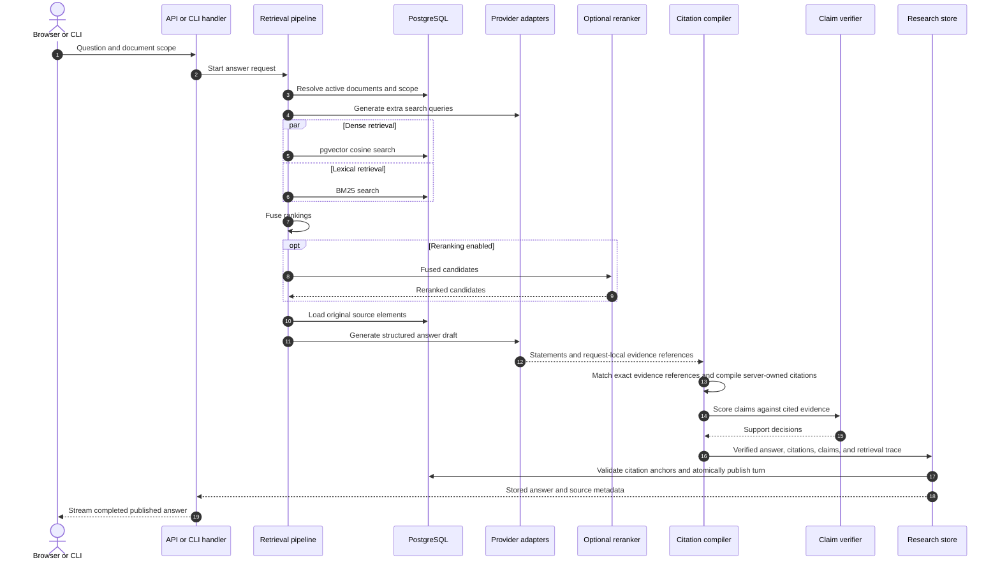

# Architecture

CiteLoom uses the same application core for its web interface, command-line interface, and background worker.
PostgreSQL stores document metadata, processing state, search indexes, settings, and shared limits for model requests.
A separate content store keeps each original source file unchanged and identifies it by its SHA-256 hash.
The web application, worker, and Docling service all use this store.
Migration saves its path in PostgreSQL, which becomes the shared location used by application processes.

## Components

| Component | Responsibility |
| --- | --- |
| Web application | Document ingestion, catalog browsing, source discovery, questions, settings, and diagnostics |
| Fastify server | Request validation, uploads, catalog operations, and streamed answers |
| Application core | Document conversion, summarization, embeddings, search, reranking, and cited answer generation |
| Background worker | Resumable document processing with jobs shared through PostgreSQL |
| Local source content store | Immutable raw source bytes addressed by SHA-256 |
| PostgreSQL | Source records, processing results, jobs, settings, search indexes, and shared model-request limits |
| Docling | Document conversion that preserves reading order, tables, page locations, and image regions |
| Model providers | Summaries, embeddings, extra search queries, reranking, answers, and optional speech |
| HHEM service | Support scores for individual answer claims and their cited evidence |
| Offline evaluation tools | Dataset generation, corpus management, scoring, tuning, and configuration freezes outside the production build |

See [the server source layout](../src/README.md) for directory ownership and dependency rules.
Evaluation tools live in [`tools/evaluation/`](../tools/evaluation/) and depend on the application core in one direction.
Production builds contain the application core without the evaluation tooling.

## Runtime topology

The provider router is application code inside each web, worker, or command-line process.
It is not a separate network service.
PostgreSQL coordinates provider-wide request limits across those processes.

The supplied Compose files run Caddy, web, worker, migration, PostgreSQL, Docling, and HHEM containers.
Local model servers such as LM Studio, Ollama, and oMLX normally run on the host and are reached from containers through `host.docker.internal`.
Cloud providers use the configured HTTPS endpoint.

## Provider routing

Provider connections, capability routes, model overrides, credentials, and concurrency limits are stored in PostgreSQL.
The application builds one typed runtime configuration and then applies the selected adapter for each capability.

Routing is capability-specific, but concurrency is provider-specific.
If answer generation, summarization, and embeddings all use one provider, they share that provider's configured request limit.
See [Provider reference](configuration.md#provider-reference) for the complete capability matrix and endpoint conventions.

## Document ingestion

An ingestion job discovers document structure, divides content into searchable sections, creates summaries and embeddings, and publishes the finished index.
The current document remains searchable until its replacement is complete.

The worker submits one Docling task to extract structure, text from images, tables, and cropped pictures.
It saves the task ID so another worker can resume the same task after an interruption.
Each Docling instance reads the source directly from the same read-only content store.
If the original Docling instance no longer recognizes a saved task, the worker clears that task checkpoint and submits the same unchanged source again.
Completed checkpoints remain available when the worker schedules a retry.

Source deletion is recorded in PostgreSQL before the local file is removed.
The worker retries pending deletions after a restart, and the same per-hash database lock serializes publication with deletion.
Newly stored content has a one-hour grace period.
This prevents cleanup from removing a file while its job is being created and limits how long files from a failed intake remain unused.

## Question answering

Before searching, CiteLoom resolves the exact set of documents selected for the question.
It searches the original question and generated query variations with both meaning-based retrieval and BM25 keyword retrieval.
It then combines those rankings and can optionally rerank the best candidates.
Reranking can improve answer and citation accuracy by using a specialized relevance model to reorder candidates before CiteLoom selects the answer context.

Each answer run uses the configured sampling temperatures.
In stable seed mode, CiteLoom derives separate seeds for extra search queries and answer generation from the normalized original question and the sorted IDs of the selected documents.
In random mode, the model provider chooses the sampling randomness.

CiteLoom shows a citation only when the answer model produced it and citation validation accepted it.
Claim-support scoring is a separate check that measures whether the cited evidence supports the answer.
It can remove unsupported citation links or statements before publication, while keeping the underlying source evidence available for inspection.
Only answers that pass validation are published.
Cancellations and service failures keep their own status.

## Persistence and concurrency

PostgreSQL leases coordinate background workers and model-request capacity across processes.
Requests routed to the same provider share that provider's request limit across the deployment.
The database publishes a completed document index in one operation, keeping partial replacements out of search.

Saved research threads keep their original answers, citations, claims, and run settings.
Each new turn also stores its generated queries, ordered source results, and exact sampling settings in a retrieval trace.
Every new turn has a retrieval trace, while older turns remain readable without one.
Submitting a question creates a new run.
Opening a saved turn returns the stored result without searching or generating it again.
The server remains the source of truth for citation identity and source metadata.
